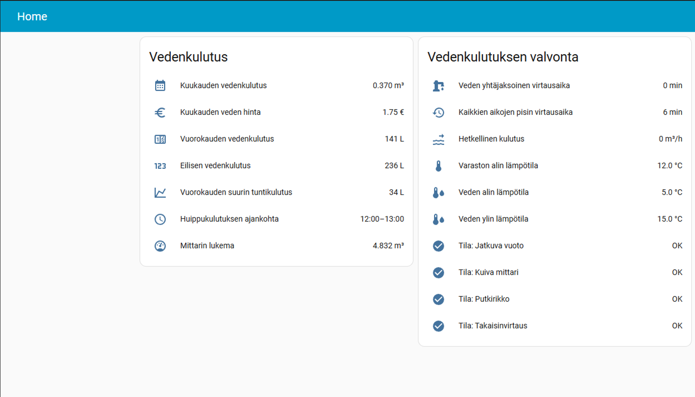
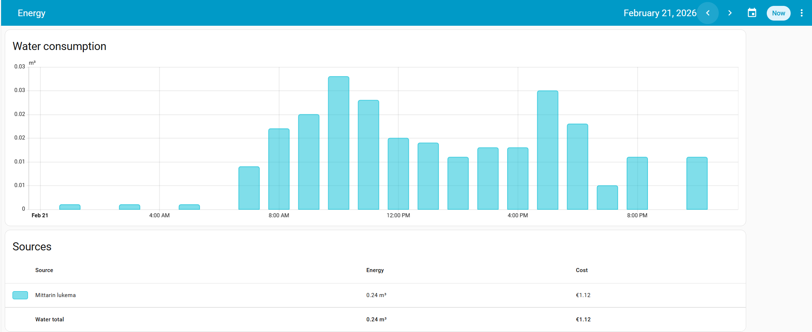
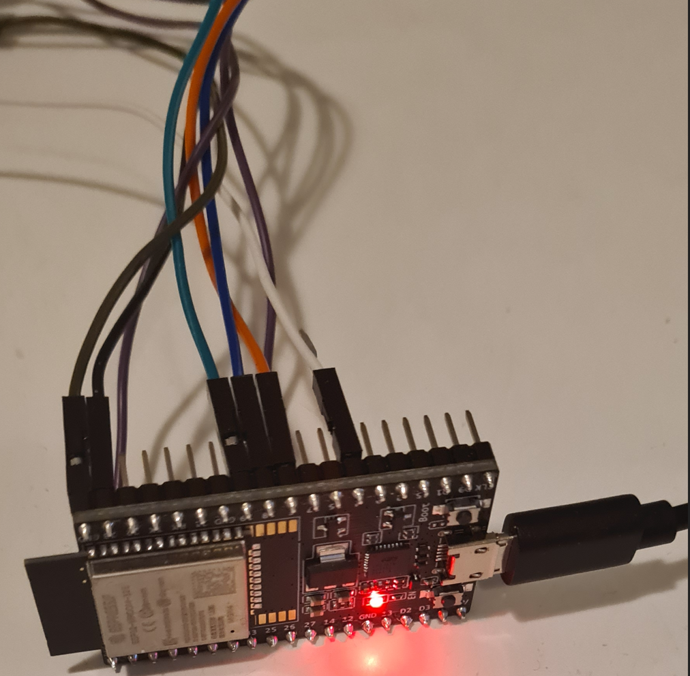

# "Vesimittarin wM-Bus-datan vastaanotto ja kulutusseuranta Home Assistantissa"

Monissa kiinteistöissä vesimittarit lähettävät kulutus- ja tilatietoja langattomasti etäluentaa varten. Halusin hyödyntää tätä, jotta voin seurata omaa vedenkulutusta ja mittarin tilatietoja Home Assistantissa.
Rakensin mittausketjun: vesimittarin wM-Bus-telegrammit vastaanotetaan 868 MHz CC1101-radiolla, ESP32 (mikrokontrolleri) välittää ne MQTT:llä Home Assistantiin ja wmbusmeters-lisäosa purkaa ne Home Assistantin sensor-entiteeteiksi. Home Assistantissa rakensin kulutus- ja kustannusseurannan sekä mittarin tila-/hälytysseurannan dashboardille.

**Teknologiat:** ESP32, CC1101 (868 MHz), wM-Bus, MQTT, Home Assistant + wmbusmeters-lisäosa

## Tulokset

### Dashboard: kulutus, kustannus ja mittarin tilat
Kuvakaappaus dashboardista, joka kokoaa yhteen olennaisimmat asiat yhdelle sivulle:
- **Kuukausi-, päivä-** sekä **kuluvan päivän huippukulutus**
- **Kustannusseuranta** (veden hinta määritelty HA:ssa)
- **Mittarin tilat ja hälytykset** (esim. jatkuva vuoto / takaisinvirtaus) sekä mittarin lämpötilat

### HA Energy -näkymä: tuntiprofiili ja seuranta
Home Assistantin Energy-näkymässä kulutus näkyy selkeästi **tuntitasolla**, jolloin:
- suihkut ja muut kulutuspiikit erottuvat helposti
- kulutuksen rytmiä voi verrata eri päivien välillä
- pohjalle on helppo rakentaa **hälytyksiä** (esim. jos kulutus jatkuu yöllä epätavallisesti)

## Toteutus lyhyesti

### 1) Laitteisto ja vastaanotto (wM-Bus 868 MHz)
Vesimittarin wM-Bus-telegrammit vastaanotetaan **radiosignaalina** 868 MHz taajuudella **CC1101**-radiomodulilla, joka on kytketty **ESP32**-mikrokontrolleriin (ESP32-WROOM-32E) SPI-väylällä. Koodasin ESP32:n vastaanotto- ja välitysohjelman itse **Arduino-ympäristössä**.

  
   
  <em>Käyttämäni ESP-32 mikrokontrolleri</em>

### 2) Siirto Home Assistantiin (MQTT)
ESP32 julkaisee vastaanotetun **wM-Bus-telegrammin payloadin** MQTT:llä Home Assistant -ympäristöön. MQTT-brokerina toimii Home Assistantin **Mosquitto broker** -lisäosa.

### 3) Purku (wmbusmeters)
Home Assistantissa **wmbusmeters-lisäosa** kuuntelee MQTT-topiccia, purkaa wM-Bus-telegrammin ja hoitaa myös **salauksen purun**. Tämän jälkeen mittausarvot muodostuvat sensoreiksi (esim. kokonaiskulutus, virtaus, lämpötilat sekä mittarin tila-/hälytysbitit).

### 4) Kulutusseuranta ja valvonta
Home Assistantissa rakensin sensoreiden pohjalta:
- **tunti-/päivä-/kuukausikulutuksen**
- **kustannusseurannan**
- **mittarin tila- ja hälytystietojen** seurannan dashboardilla

## Testaus ja vianrajaus (päästä päähän)

- **Radiovastaanotto:** varmistin ESP32:n debug-/lokitulosteista, että telegrammeja tulee odotetulla tahdilla ja että ne vastaavat omaa mittaria.
- **Purku paikallisesti:** testasin salauksen purun ja telegrammien lukemisen ajamalla **wmbusmeters**-ohjelmaa omassa ympäristössä ennen Home Assistant -integraatiota.
- **MQTT-siirto:** varmistin, että viestit näkyvät brokerilla ja että Home Assistant vastaanottaa ne.
- **HA-sensorit ja lopputulos:** varmistin wmbusmeters-lisäosan lokien avulla, että telegrammien purku onnistuu. Tämän jälkeen tarkistin, että wmbusmeters luo oikeat Home Assistant -sensorit. Lopuksi seurasin dashboard- ja Energy-näkymiä ja varmistin, että sensorien arvot vastaavat odotettua kulutusta.
- **Luotettavuus ja diagnostiikka (jatkokehitys):** MQTT:n kautta voisi lähettää erillisen **keep-alive/heartbeat**-viestin (ja käyttää MQTT:n **Last Will** -ominaisuutta), jotta nähdään onko ESP32 käynnissä. Tällöin häiriötilanteissa voidaan erottaa helpommin, johtuuko ongelma ESP32:n virrasta/yhteydestä vai radiosignaalin vastaanotosta.
